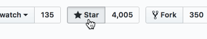

Business Email Checker
======================
[](https://travis-ci.org/salaros/is-biz-mail-js)
[](https://coveralls.io/github/salaros/is-biz-mail-js?branch=master)
[](http://inch-ci.org/github/salaros/is-biz-mail-js)
[](https://snyk.io//test/github/salaros/is-biz-mail-js?targetFile=package.json)


[](https://github.com/salaros/is-biz-mail-js/blob/master/LICENSE)

[](https://www.npmjs.com/package/is-biz-mail)


[](https://www.patreon.com/salaros/)
[](https://paypal.me/salarosIT)
[](https://liberapay.com/salaros/)

**isBizMail** tells you whether a given email address is free (gmail.com, yahoo.es, yandex.ru etc) or not. Detects around 4-5k domains and sub-domains.

Under the hood **isBizMail** mostly relies on 3-rd party domain lists created by people and organizations mentioned in [Credits](#Credits) section.

## Looking for PHP, .NET etc?

* [PHP implementation](https://github.com/salaros/is-biz-mail-php) (PHP 5.4.0+)
* [.NET implementation](https://github.com/salaros/is-biz-mail-dotnet) (.NET Standard 2.0+)

## 🟊🟊🟊 Support this project 🟊🟊🟊

You can support us in a small way, please consider starring and sharing this repo! It helps us getting known and grow the community.



## Installation

You can install **isBizMail** for JavaScript via your prefered dependency manager, e.g. PNMP, Yarn etc

```bash
npm i @salaros/is-biz-mail # pnpm add @salaros/is-biz-mail
```

or via Yarn

```bash
yarn add @salaros/is-biz-mail
```

## Vanilla

One of examples of vanilla JavaScript usage might be a simple HTML page:

```html
<script src="https://cdn.jsdelivr.net/npm/@salaros/is-biz-mail@latest/dist/isBizMail.iife.js"></script>
<script>
    var email = 'foo@nodejs.onmicrosoft.com';
    var result = new isBizMail().isFree(email);
    console.log([email, result]); // (2) ["foo@nodejs.onmicrosoft.com", false], because *.onmicrosoft.com is considered a free domain
</script>
```

## TS / ESM

```js
import IsBizMail from '@salaros/is-biz-mail';
const isBizMail = new IsBizMail();

const email = 'es6@gmail.com';
const result = isBizMail.isFree(email);
console.log([email, result]); // (2) ["es6@gmail.com", true]
// ...
```

## [CommonJS](http://requirejs.org/docs/commonjs.html), Node.js etc

```js
const IsBizMail = require('@salaros/is-biz-mail');
const isBizMail = new IsBizMail();

const email = 'cjs@yahoo.com';
const result = isBizMail.isFree(email);
console.log([email, result]); // (2) ["cjs@yahoo.com", true]
// ...
```

## Testing: [Jest](https://jestjs.io/)

```bash
npm install # pnpm/yarn install
npm test    # pnpm/yarn test
```

## Credits

* SpamAssasin's ['freemail domains'](https://raw.githubusercontent.com/apache/spamassassin/trunk/rules/20_freemail_domains.cf) filter
* SpamAssasin's ['mailcom domains'](https://raw.githubusercontent.com/apache/spamassassin/trunk/rules/20_freemail_domains.cf) filter
* Matthieu Moquet's [list of disposable emails](https://raw.githubusercontent.com/MattKetmo/EmailChecker/master/res/throwaway_domains.txt).
